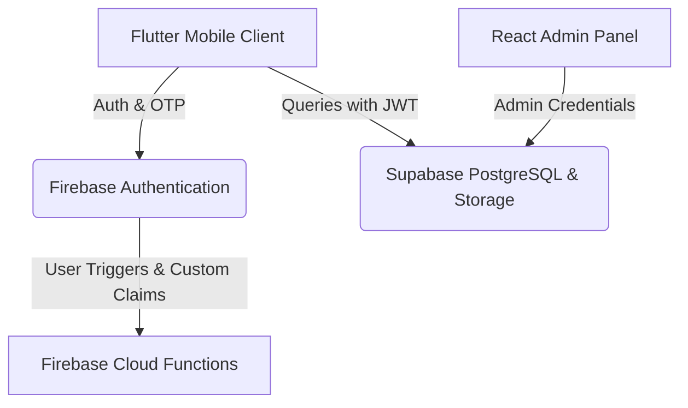

# CommunityConnect

CommunityConnect is a premium, mobile-based community management platform designed for local regions, wards, panchayats, and residential communities. It empowers families, organizers, and local authorities to coordinate announcements, invitations, notifications, and events in a secure, centralized, and real-time environment.

---

## 🏛️ Architecture & Tech Stack

This project is built using a **hybrid architecture** that combines the robustness of Firebase Services with the relational capability and security of Supabase PostgreSQL:



*   **Frontend (Mobile App)**: Flutter (Dart) utilizing Riverpod for state management.
*   **Web Console (Admin Panel)**: React.js with TypeScript and Vite.
*   **Authentication & Notifications**: Firebase Auth (for SMS OTP support) and Firebase Cloud Messaging (FCM).
*   **Database & File Storage**: Supabase (PostgreSQL with Row-Level Security, real-time channels, and storage buckets).
*   **Security layer**: Custom OIDC claims linking Firebase identities to Supabase's `auth.uid()` and custom PostgreSQL policy triggers.

---

## 📂 Repository Structure

```text
├── admin/                     # React Admin Dashboard (Vite + TS)
├── mobile/                    # Flutter Mobile Application
│   ├── android/               # Native Android configurations
│   ├── ios/                   # Native iOS configurations
│   └── lib/                   # Flutter application source code
├── scripts/
│   └── firebase_auth/         # Admin migration utilities & Cloud Function triggers
└── schema.sql                 # Idempotent Supabase Database Schema
```

---

## 🚀 Getting Started

### 1. Database Schema Setup
1. Log in to your **Supabase Dashboard** and open your project's **SQL Editor**.
2. Copy and run the contents of [schema.sql](file:///home/anirudhs/Documents/Boredom/Community_Connect/schema.sql) to set up tables, real-time publications, and Row-Level Security (RLS) policies.

### 2. Configure Third-Party Auth (Supabase)
To accept Firebase credentials:
1. Navigate to **Authentication Settings** in your Supabase Dashboard.
2. Under **Third-Party Auth / Custom JWT Providers**, add a new provider for **Firebase**.
3. Enter your **Firebase Project ID**.

### 3. Setup Firebase Custom Claims Trigger
New sign-ups must receive the `role: 'authenticated'` claim.
1. Deploy the Cloud Function in [user_created_trigger.js](file:///home/anirudhs/Documents/Boredom/Community_Connect/scripts/firebase_auth/user_created_trigger.js) to your Firebase project.
2. To sync existing users, run:
   ```bash
   cd scripts/firebase_auth
   npm install
   export GOOGLE_APPLICATION_CREDENTIALS="path/to/serviceAccountKey.json"
   node migrate_existing_users.js
   ```

### 4. Running the Mobile App
1. Ensure your Flutter environment is configured (Flutter 3.x+).
2. Create/restore your configurations:
   * **Android**: Place your `google-services.json` in `mobile/android/app/`.
   * **iOS**: Place your `GoogleService-Info.plist` in `mobile/ios/Runner/`.
3. Configure `mobile/lib/main.dart` with your Supabase URL, Anon Key, and Firebase Options.
4. Run:
   ```bash
   cd mobile
   flutter pub get
   flutter run
   ```

### 5. Running the Admin Dashboard
1. Create an `admin/.env` file with your Supabase URL and Anon Key.
2. Run:
   ```bash
   cd admin
   npm install
   npm run dev
   ```

---

## 🛡️ License

This project is licensed under the MIT License.
